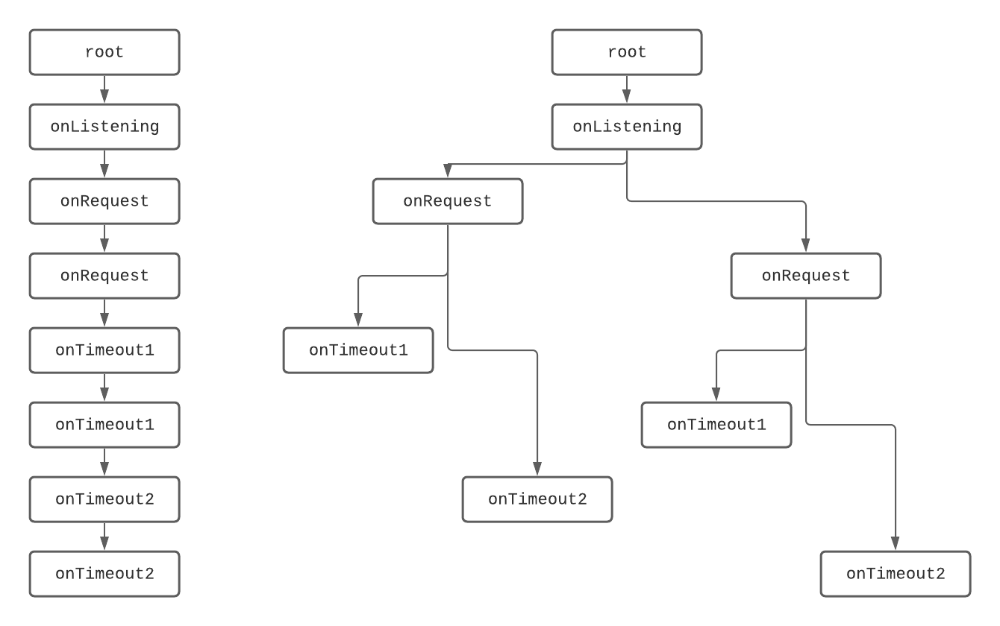

# Using the Appmap Framework to Represent Event-driven Programs

## Problem Statement

The appmap framework was developed for languages that implement concurrency via threading.
Adapting this model for event-driven programs is challenging.
Next we demonstrate this issue through an example program that perform two sql queries concurrently.

### Ruby Implementation

The ruby program below performs two sql queries concurrently:

```rb
# sql.rb
require 'sqlite3'
class Main
  def main ()
    db = SQLite3::Database.new(':memory:');
    thread = Thread.new {
      x = db.execute('SELECT 2 * 3')[0][0]
      puts(x)
    }
    x = db.execute('SELECT 4 * 5')[0][0];
    puts(x)
    thread.join
    return 0
  end
end
Main.new.main()
```

This program will output `6` and `20` in an non-deterministic order based on thread interleaving.
If we want trace the call stack of this program, we could develop the simplistic library below:

```rb
# trace.rb
$ctr = 0
def trace (obj, key, *args)
  $ctr += 1
  idx = $ctr
  puts("#{Thread.current.object_id} call   \##{idx} #{key} #{args}")
  res = obj.send(key, *args)
  puts("#{Thread.current.object_id} return \##{idx} #{key} #{res}")
  return res
end
```

All that is needed now is to pass method invocation of interest to the trace function:

```rb
# sql-trace.rb
require 'sqlite3'
require './trace.rb'
class Main
  def main
    db = SQLite3::Database.new(':memory:');
    thread = Thread.new {
      x = trace(db, :execute, 'SELECT 2 * 3')
      trace(self, :puts, x)
    }
    x = trace(db, :execute, 'SELECT 4 * 5')
    trace(self, :puts, x)
    thread.join()
    return 0
  end
end
trace(Main.new, :main)
```

One possible thread interleaving would lead to the following trace:

```
60 call   #1 main []
60 call   #2 execute ["SELECT 4 * 5"]
60 return #2 execute [[20]]
60 call   #4 puts [[[20]]]
60 return #4 puts 
80 call   #3 execute ["SELECT 2 * 3"]
80 return #3 execute [[6]]
80 call   #5 puts [[[6]]]
80 return #5 puts 
60 return #1 main 0
```

To interpret this file, the Appmap framework will separate the call stack trace based on thread ids.

The main thread would contain the `main` function, the second sql query, and the second `puts` function call:

```
60 call   #1 main []
60 call   #2 execute ["SELECT 4 * 5"]
60 return #2 execute [[20]]
60 call   #4 puts [[[20]]]
60 return #4 puts 
60 return #1 main 0
```

The child thread would contain the first sql query the first `puts` function call:

```
80 call   #3 execute ["SELECT 2 * 3"]
80 return #3 execute [[6]]
80 call   #5 puts [[[6]]]
80 return #5 puts
```

We can see that each thread-specific trace is ordered as a fifo which expected as it represents the call stack of its thread.
This fifo ordering is very important for the framework to properly display appmaps.

TLDR: the appmap framework relies on each thread-specific trace to exhibit a fifo ordering.

### JavaScript Implementation

In JavaScript the same requirements could have been implemented as a such:

```js
// sql.mjs
import util from 'util';
import sqlite3 from 'sqlite3';
const db = new sqlite3.Database(':memory:');
const execute = util.promisify(db.all.bind(db));
const main = () => {
  execute('SELECT 2 * 3 as x').then(([{x}]) => {
    console.log(x);
  });
  execute('SELECT 4 * 5 as x').then(([{x}]) => {
    console.log(x);
  });
  return 0;
}
main();
```

Again, this program will output `6` and `20` in an non-deterministic order.
But the order is based on event interleaving rather than thread interleaving.
If we want to trace this program, our simplistic library will have to support two kinds of function: synchronous functions and asynchronous functions.

```js
// trace.mjs
let ctr = 0;
export const trace = (fct, ...args) => {
  ctr += 1;
  const idx = ctr;
  console.log(`${process.pid} call   #${idx} ${fct.name} ${JSON.stringify(args)}`);
  const res = fct(...args);
  console.log(`${process.pid} return #${idx} ${fct.name} ${JSON.stringify(res)}`);
  return res;
};
export const traceAsync = async (fct, ...args) => {
  ctr += 1;
  const idx = ctr;
  console.log(`${process.pid} call   #${idx} ${fct.name} ${JSON.stringify(args)}`);
  const res = await fct(...args);
  console.log(`${process.pid} return #${idx} ${fct.name} ${JSON.stringify(res)}`);
  return res;
};
```

We can now instrument the original program to trace it:

```js
// sql-trace.mjs
import util from 'util';
import sqlite3 from 'sqlite3';
import {trace, traceAsync} from './trace.mjs'
const db = new sqlite3.Database(':memory:');
const execute = util.promisify(db.all.bind(db));
const logTrace = (x) => trace(log, x);
const main = () => {
  traceAsync(execute, 'SELECT 2 * 3 as x').then(([{x}]) => {
    trace(console.log, x);
  });
  traceAsync(execute, 'SELECT 4 * 5 as x').then(([{x}]) => {
    trace(console.log, x);
  });
  return 0;
}
trace(main);
```

One possible event interleaving would lead to the following trace:

```
93124 call   #1 main []
93124 call   #2 execute ["SELECT 2 * 3 as x"]
93124 call   #3 execute ["SELECT 4 * 5 as x"]
93124 return #1 main 0
93124 return #3 execute [{"x":6}]
93124 call   #4 log [[{"x":6}]]
93124 return #4 log undefined
93124 return #4 execute [{"x":20}]
93124 call   #5 log [[{"x":20}]]
93124 return #5 log undefined
```

We can observe two problems.
* JavaScript being single-threaded we are missing an out-of-the-box data to de-interleave this call stack.
* There exists no partitioning of this call stack trace whose lines are fifos.
  Indeed, the main function will always return before the second sql query.

## Desiderata

What do we even want?
Let's set aside the "how" for the moment and focus on the "what".

### First Option: Cheating

The first option consists in replicating what was observed in ruby by "cheating".

The first fifo should contain the first sql query and the first `console.log` function call:

```
93232 call   #2 execute ["SELECT 2 * 3 as x"]
93232 return #2 execute [{"x":6}]
93232 call   #4 log [6]
93232 return #4 log undefined
```

The second fifo should contain the `main` function call, the second sql query, and the second `console.log` function call:

```
93232 call   #1 main []
93232 call   #3 execute ["SELECT 4 * 5 as x"]
93232 return #3 execute [{"x":20}]
93232 call   #5 log [20]
93232 return #5 log undefined
93232 return #1 main 0
```

Note that to obtain a fifo we had to "cheat" and move the return of the `main` function call to the last position.
Rearranging call stack lines is dangerous and can lead to logical inconsistencies.
For instance we could end up displaying `DROP TABLE user` before `SELECT * from user`.

### Second Option: One Fifo per Event

The second option consists in embracing the event-based nature of JavaScript and creating one fifo for every event processing.

The first fifo represents the initial phase:

```
call   #1 main []
call   #2 execute ["SELECT 2 * 3 as x"]
return #2 execute Promise#1
call   #3 execute ["SELECT 4 * 5 as x"]
return #3 execute Promise#2
return #1 main 0
```

The second fifo represents the handling attached to the first sql query:

```
call   #4 resolve Promise#1 [{"x":6}]
call   #5 log [6]
return #5 log undefined
return #4 resolve
```

The third fifo represents the handling attached to the second sql query:

```
return #3 resolve Promise#2 [{"x":20}]
call   #5 log [20]
return #5 log undefined
return #3 resolve
```

This option reflects better the reality of the execution of the program.
And more importantly we do not have to cheat.
The drawback of this option is that the causality link between the first fifo and two others is lost.
Indeed, the appmap framework being language-agnostic it cannot use promise ids to recover that causality link.

### Third Options: Bundling Events

A nice property of fifos is that concatenating them together still result in a fifo.
So we are free to bundle them at our liking to indicate to the appmap framework that they are somehow linked.
Note that to respect the timeline, the bundling should conserve the order between fifos.
Else we would be at risk of introducing logical inconsistencies as for our "cheating" option.

First lets note that the handling of an event can be causally linked to the handling of another event.
Indeed, each time an event is processed, it is done so by executing a callback function.
By tracking callback registering, we can book keep which event caused which callback to be registered.
Hence we can improve our understanding of event handling not as sequence but as a causal tree.

```js
import {createServer} from "http";
const server = createServer();
server.listen(0, function onListening () {
  console.log(`listening to port ${server.address().port}`);
  server.on("request", function onRequest (req, res) {
    setTimeout(function onTimeout1() {
      res.writeHead(200);
    }, 1000);
    setTimeout(function onTimeout2() {
      res.end("foobar");
    }, 2000);
  });
});

```



If we want to simulate the ruby trace we can recursively bound each event their first (in time) causally linked child event.
Each bundle would then represent a linear sequence of event handling where nothing appears concurrently.
This would effectively mimic threading.

However I argue that the better solution would be to bundle event based on their kinds.
For servers, the `root` event should be bundled with setup operations (eg `onListening` in the example above) and each `onRequest` event should be bundled with their entire causal tree.
Note that the limit may not be always as clear cut and some user tweaking would probably be required to find the appropriate granularity for a given application.
